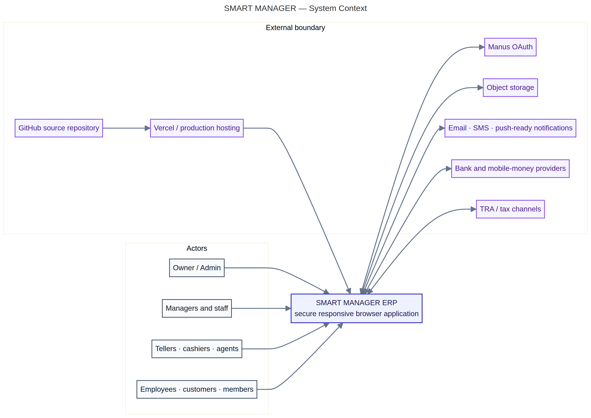
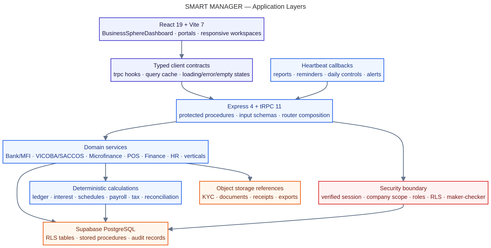
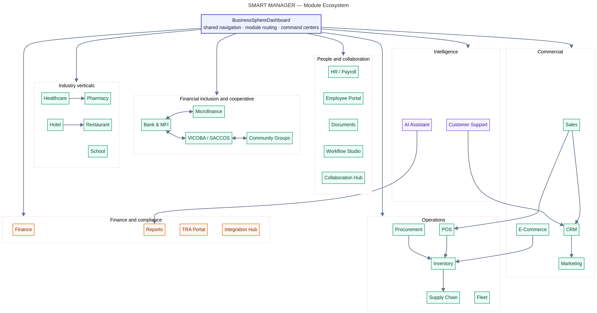
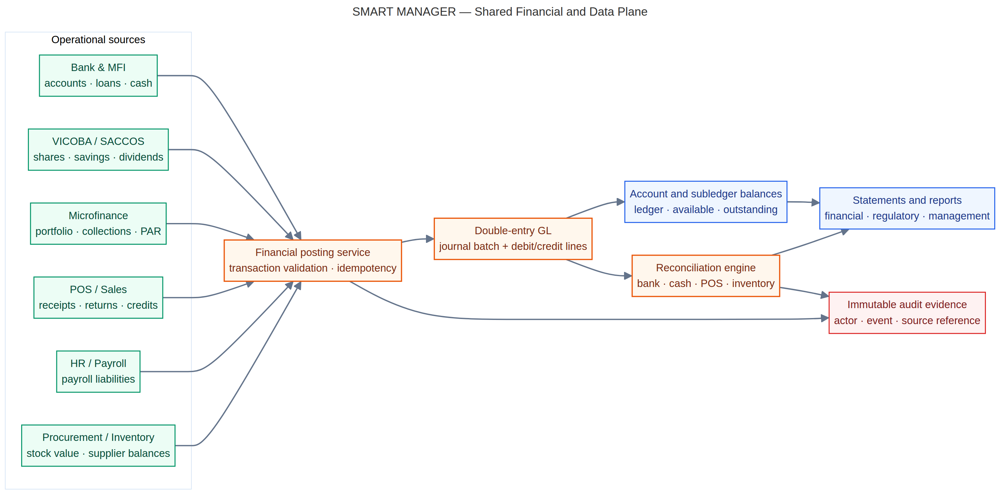
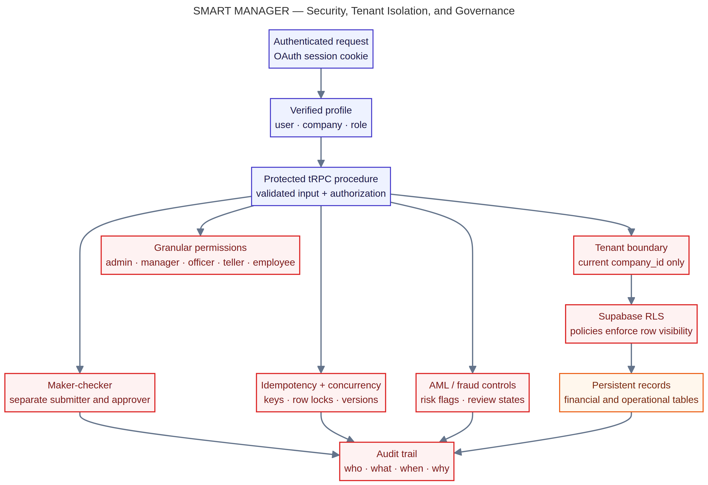
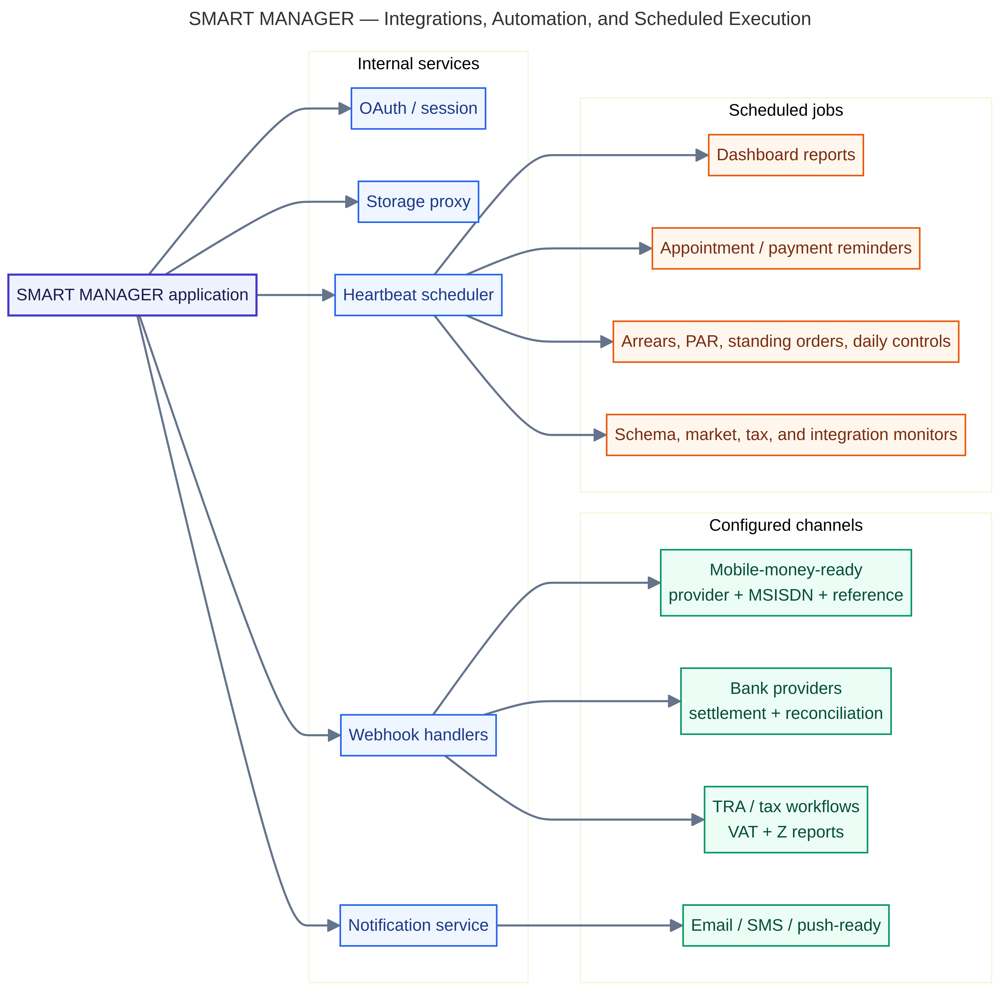
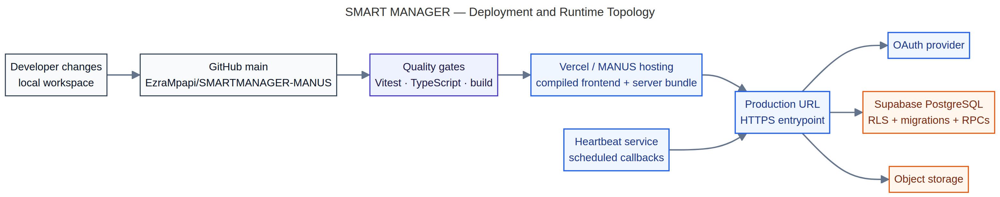
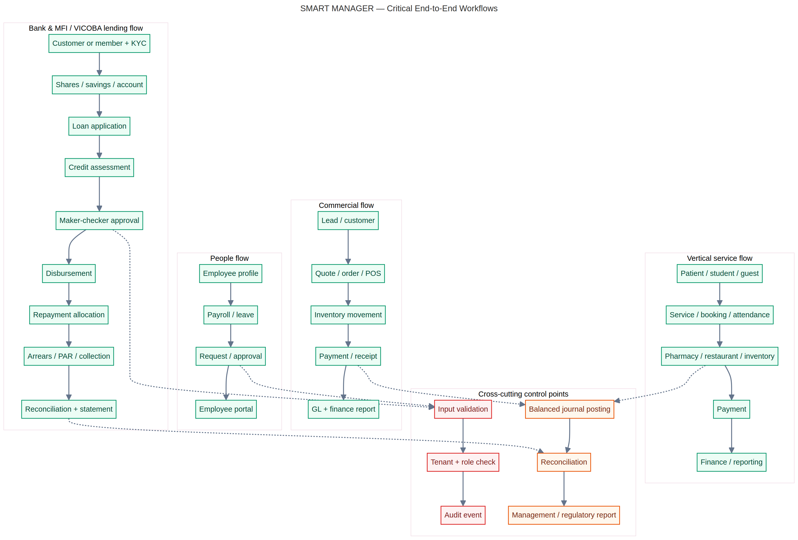

# SMART MANAGER ERP — Senior Developer Architecture Guide

**Author:** Manus AI
**Purpose:** Provide a reviewable architecture model of the existing SMART MANAGER ERP without collapsing all responsibilities into one unreadable canvas.

## Executive architecture position

SMART MANAGER is a multi-domain ERP with a shared application shell, protected server procedures, Supabase-backed business data, and domain-specific workflows. The architecture is strongest when understood as a set of bounded capabilities connected through common controls: identity, company tenancy, permissions, auditability, financial posting, reconciliation, reporting, storage, and notifications.

The diagram set deliberately uses separate images because architecture has several different audiences. Executives need the system boundary and module map; engineers need the request path and deployment topology; finance and risk teams need the ledger and control plane; operations teams need workflow and integration views. Each diagram below answers one architectural question and should be read together with the others.

| # | Diagram | Primary audience | Main question |
|---:|---|---|---|
| 1 | System context | Product owners, enterprise architects | What is inside SMART MANAGER and what remains external? |
| 2 | Application layers | Full-stack engineers | How does a request move from UI to persistent data? |
| 3 | Module ecosystem | Product and platform teams | How are the ERP modules grouped and connected? |
| 4 | Financial and data plane | Finance, accounting, risk, backend engineers | How do operational events become controlled financial records? |
| 5 | Security and tenancy | Security, compliance, backend engineers | Where are identity, authorization, isolation, and audit enforced? |
| 6 | Integrations and automation | Platform and operations teams | How are providers and recurring processes safely coordinated? |
| 7 | Deployment and runtime | DevOps and release owners | How does code become a verified production runtime? |
| 8 | Critical workflows | Business analysts, QA, product owners | How do the most important journeys cross shared controls? |

## 1. System context

The system-context diagram establishes the architectural boundary. SMART MANAGER is the system of record for ERP workflows, but it does not own every surrounding capability. OAuth supplies identity, object storage holds document references, notification channels deliver messages, banks and mobile-money providers perform external settlement, tax channels support compliance workflows, GitHub is the source-control system, and Vercel or MANUS hosting exposes the deployed runtime.

From a senior engineering perspective, this boundary is important because external systems must be modeled as **explicit adapters with status and reference identifiers**, not as invisible assumptions. For example, a mobile-money transaction should remain pending or provider-confirmed until an authoritative callback or reconciliation step is available. The ERP should never fabricate a successful settlement merely because a user clicked a button.

## 2. Application layers

The application-layer diagram shows the expected request path. Responsive React workspaces present the user experience. Typed tRPC contracts define the client/server boundary. Express and tRPC procedures validate input and authorize the requested operation. Domain services implement business behavior, while deterministic calculation helpers handle schedules, interest, ledger allocations, payroll, tax, and reconciliation rules.

The critical design principle is **separation of concerns with testable seams**. A UI component should not be responsible for deciding tenant identity or inventing a balance. A server procedure should not trust a client-provided company identifier or approval actor. A financial calculation should be deterministic and independently testable. Persistent writes should occur only after the relevant authorization and invariant checks have passed.

## 3. Module ecosystem

The module-ecosystem diagram explains why the product should evolve incrementally rather than being rebuilt as a new application. The shared `BusinessSphereDashboard` shell provides navigation and command-center composition. Domain groups then organize commercial capabilities, operations, finance and compliance, people and collaboration, financial inclusion, industry verticals, and intelligence.

The arrows illustrate business relationships rather than ownership of every table. Sales can affect inventory and POS; procurement affects stock and supplier balances; Bank & MFI integrates with Microfinance and VICOBA/SACCOS; healthcare can depend on pharmacy; support relates to CRM; AI and reporting consume controlled operational information. The architecture should preserve these module boundaries while using shared platform primitives for authentication, routing, persistence, audit, and reporting.

## 4. Shared financial and data plane

This diagram is the accounting spine of the ERP. Bank & MFI, VICOBA/SACCOS, Microfinance, POS, HR/payroll, procurement, and inventory generate operational events. Those events pass through a posting service that validates the transaction, applies idempotency and concurrency rules, and produces balanced journal batches and journal lines. Subledger balances, reconciliation, statements, and management reports are downstream products of those controlled records.

A production financial system must not treat a displayed balance as the source of truth. The source of truth is the auditable transaction and its balanced debit/credit effect, with subledger balances derived or updated under controlled procedures. Reconciliation is a first-class capability: bank statements, cash tills, POS receipts, inventory value, and internal ledgers must be compared and exceptions retained for investigation.

## 5. Security, tenant isolation, and governance

The security diagram models defense in depth. An authenticated request is converted into a verified profile containing the user, company, and role. Protected procedures validate input and apply authorization before accessing data. The company boundary is enforced in the server path and again by Supabase Row Level Security. Granular permissions determine which roles may submit, approve, post, reverse, reconcile, or view sensitive operations.

Financial and cooperative workflows additionally require maker-checker separation, idempotency keys, row locking or version checks, AML and fraud review states, and auditable events. These controls are not optional UI features; they are server-side invariants. A hidden button is not authorization, and a client-supplied actor or company field is not trustworthy evidence.

## 6. Integrations, automation, and scheduled execution

The integration diagram separates internal services from configured external channels. OAuth, storage, notifications, heartbeat scheduling, and webhook handlers are internal integration points. Mobile money, banks, TRA, and messaging channels are external boundaries that require provider-aware status handling, idempotent references, and reconciliation.

Recurring processes such as report refreshes, payment reminders, arrears aging, PAR monitoring, standing-order processing, and daily controls should run through the established heartbeat or scheduled-callback pattern. A free-running ad-hoc timer inside a web process is not a reliable production scheduler because it can duplicate work, disappear during deployment, or run without an auditable owner and execution record.

## 7. Deployment and runtime topology

The deployment diagram describes a release pipeline rather than merely a hosting destination. Developer changes move into the canonical GitHub `main` branch, pass Vitest, TypeScript, and production-build checks, and then become a hosted frontend/server bundle. The production HTTPS entrypoint connects to OAuth, Supabase PostgreSQL with migrations/RPCs/RLS, object storage, and scheduled callbacks.

The senior-level operational rule is that **a successful push is not equivalent to a verified deployment**. Release acceptance requires a ready deployment, accessible runtime, database compatibility, and a browser-level smoke check of the affected workflows. When access to the hosting team or private repository is missing, that is an explicit deployment blocker rather than a reason to claim production completion.

## 8. Critical end-to-end workflows

The workflow diagram connects business journeys to platform controls. The Bank & MFI and VICOBA/SACCOS path begins with customer/member KYC, proceeds through shares or savings and account ownership, then moves through application, scoring, maker-checker approval, disbursement, repayment allocation, arrears/PAR collection, reconciliation, and statements. Commercial operations connect lead or customer activity to orders, inventory, payment, and GL reporting. People operations connect employee records to payroll, approvals, and the employee portal. Vertical services connect patients, students, or guests to service delivery, inventory, payment, and reporting.

The dashed control links are intentional. Validation, tenant and role checks, balanced journal posting, reconciliation, audit events, and management or regulatory reports are shared control points across different business domains. This makes the architecture scalable: a new module can reuse the platform controls without copying unsafe financial or authorization logic into every screen.

## Senior developer review conclusions

The architecture has a defensible foundation for incremental production development because it preserves the existing product shell while adding persistent domain services and database controls. The principal architectural risk is not the number of modules; it is accidental bypass of shared controls. New features should therefore be implemented as additive migrations, protected server procedures, company-scoped records, auditable mutations, deterministic calculations, and responsive workspaces that consume real persistent data.

For the VICOBA/SACCOS expansion, the correct implementation direction is to reuse the Bank & MFI patterns for tenant verification, RLS, maker-checker approvals, ledger posting, idempotency, reconciliation, and Tanzania-ready identifiers, while adding cooperative-specific aggregates such as groups, members, shares, savings, welfare, meetings, elections, dividends, guarantors, and group lending. The integration should be through domain services and shared financial posting—not by duplicating mock data or directly mutating unrelated module tables from the browser.

## Source files

Every figure has an editable Mermaid source beside its PNG counterpart. The deterministic source files are:

| Figure | Editable source | Rendered image |
|---:|---|---|
| 1 | `01_system_context.mmd` | `01_system_context.png` |
| 2 | `02_application_layers.mmd` | `02_application_layers.png` |
| 3 | `03_module_ecosystem.mmd` | `03_module_ecosystem.png` |
| 4 | `04_financial_data_plane.mmd` | `04_financial_data_plane.png` |
| 5 | `05_security_tenancy.mmd` | `05_security_tenancy.png` |
| 6 | `06_integrations_automation.mmd` | `06_integrations_automation.png` |
| 7 | `07_deployment_runtime.mmd` | `07_deployment_runtime.png` |
| 8 | `08_critical_workflows.mmd` | `08_critical_workflows.png` |

This guide describes the architecture represented by the current project context and implementation evidence. It is an architecture communication artifact, not a claim that every future VICOBA/SACCOS capability has already been implemented.
