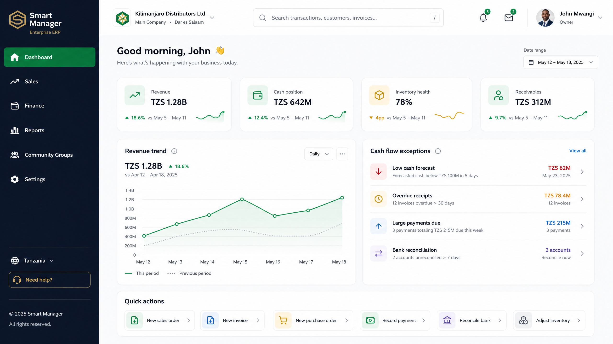
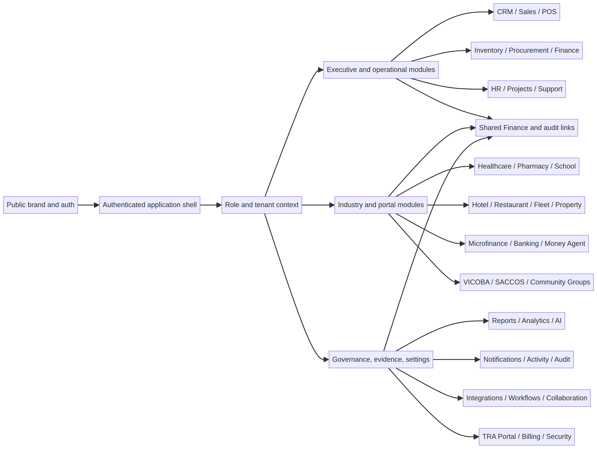
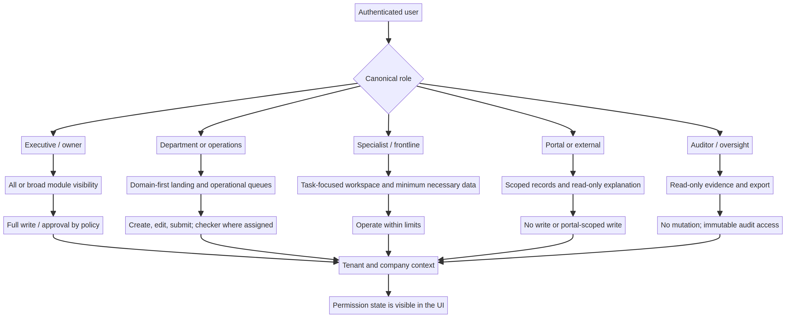
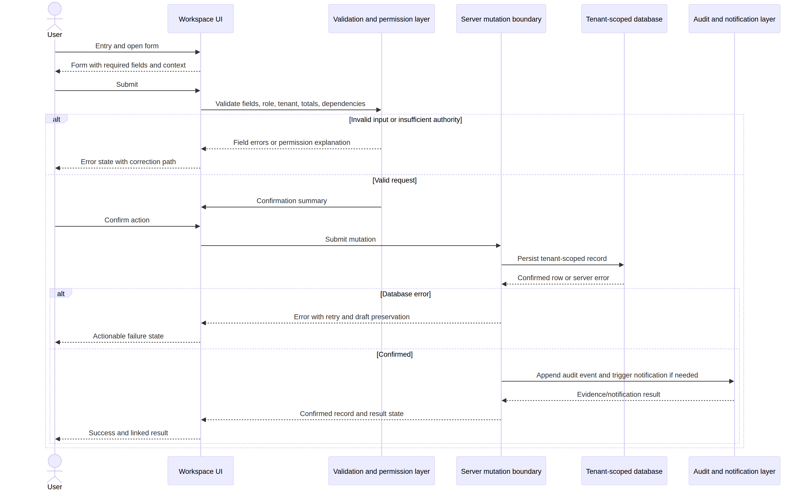
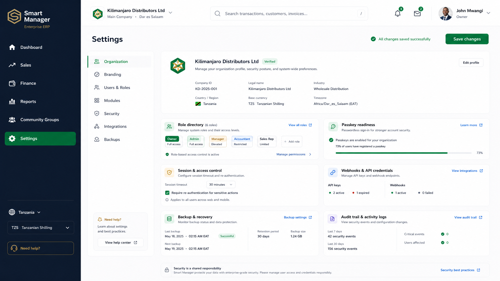
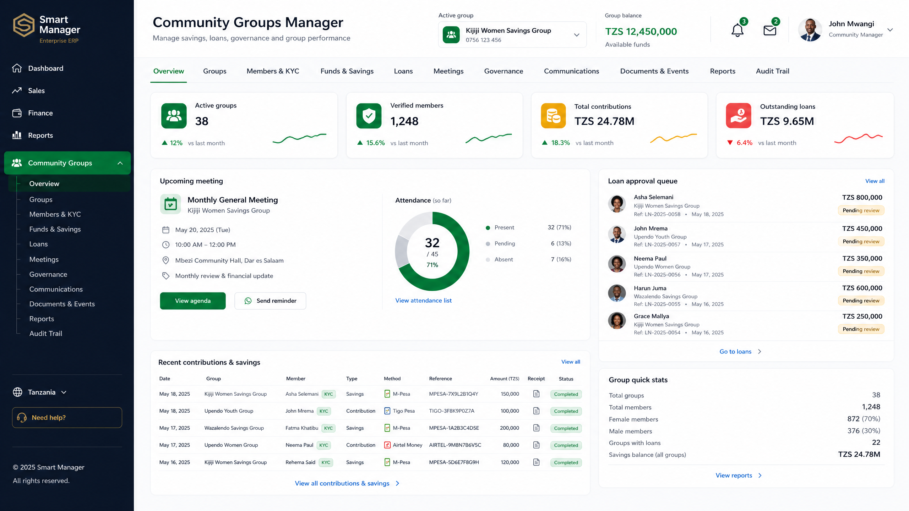
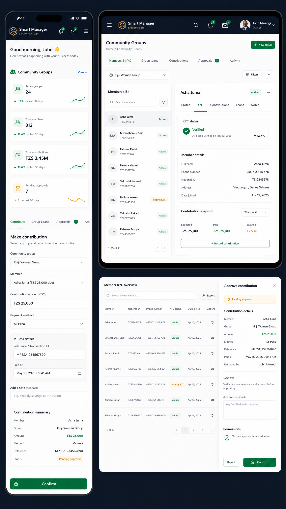
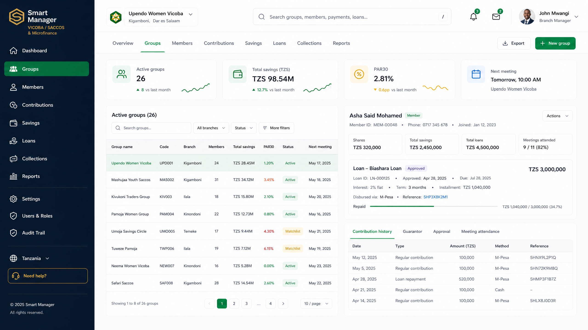

# SMART MANAGER — Complete UI/UX Design System & Application Blueprint

## Cover
### SMART MANAGER
### Complete UI/UX Design System & Application Blueprint
Source-grounded product design summary | August 2026

## Slide 1
### The blueprint starts with the real product

A source-first audit translated the existing application into a coherent design direction without pretending that every source ID is already an independent route.

| Verified baseline | Count |
|---|---:|
| Navigation modules | **39** |
| Source-defined roles | **36** |
| React / TypeScript components detected | **924** |
| Module screen records | **234** |

The result is a design package that distinguishes implemented shared surfaces, specialized workspaces, and implementation follow-up.

## Slide 2
### One product language — Tanzania-first and enterprise-ready

SMART MANAGER should feel calm, serious, and trustworthy with money, people, compliance, and evidence while remaining recognizably local.

- **Noble shell:** deep slate and navy create a stable, premium application frame.
- **Operational clarity:** emerald confirms action; gold marks premium focus; danger is reserved for risk.
- **Local readiness:** TZS, mobile-money-ready flows, TRA context, and regional identity cues are designed into the system.
- **Human-readable density:** Poppins landmarks plus Inter operational text, with a disciplined 4/8px rhythm.

## Slide 3
### The persistent shell makes a broad platform navigable

Every workspace follows the same mental model: global context first, operational work second, trust and recovery always visible.

- **Global context:** tenant, branch, role, date, freshness, notifications, account.
- **Module context:** active module, tab, record scope, filters, and time period.
- **Operational canvas:** KPIs, queues, tables, charts, forms, and action panels.
- **Trust layer:** validation, approvals, audit evidence, permission explanations, and source freshness.

## Slide 4
### Role-aware UX turns permissions into understandable action

The 36-role model is expressed through both visibility and action-level communication.

| Experience mode | User question | Design priority |
|---|---|---|
| Executive | What needs attention now? | KPIs, exceptions, decisions |
| Operator | What do I do next? | Queue, form, status, confirmation |
| Reviewer | Is this correct and authorized? | Evidence, diffs, approvals |
| Frontline | Can I finish quickly and safely? | Large actions, search, receipt, retry |
| Portal | What belongs to me? | Narrow scope, plain language, mobile-first |
| Specialist | Which domain state needs expertise? | Domain tabs, minimum-necessary data |

## Slide 5
### Every critical transaction follows one recoverable sequence

The interaction grammar is deliberately consistent across sales, lending, contributions, procurement, POS, healthcare, reporting, and administration.

**Entry → Form → Validation → Confirmation → Processing → Success → Result**

A failed mutation exits through **Error → Retry or Save draft**. The design never treats a success toast as proof of persistence; the result view must show the confirmed record or an actionable server error.

## Slide 6
### A reusable component grammar keeps the system coherent

The design system specifies component behavior—not only colors—so states remain predictable across domains.

- **Tables:** sticky headers, visible status chips, bulk mode, responsive scroll containers.
- **Forms:** sectioned fields, required markers, inline validation, draft preservation, server-error recovery.
- **Actions:** idle, hover, pressed, loading, disabled, and permission-blocked states.
- **Evidence:** audit timelines with actor, time, action, resource, and evidence link.
- **Accessibility:** visible focus, keyboard order, 44px mobile targets, text plus color for status, reduced motion.

## Slide 7
### The same grammar scales across 39 domain workspaces

The blueprint keeps the shell and interaction patterns stable while allowing domain-specific records and evidence.

| Core commercial loop | Specialist and vertical surfaces |
|---|---|
| CRM, Sales, Billing, Inventory | Healthcare, Pharmacy, School, Hotel |
| Procurement, Finance, Reports | Restaurant, Fleet, Property |
| POS, Notifications, Audit | Banking & MFI, Microfinance, VICOBA |
| Integrations, Workflow Studio | Community Groups, TRA Portal, Employee Portal |

Community Groups and VICOBA/SACCOS share member-led savings, meetings, contributions, loans, approvals, and reporting patterns; TRA and Finance share tax/evidence handoffs.

## Slide 8
### Responsive design preserves operational usefulness

Responsive behavior changes the frame—not the integrity of the work.

- **Desktop:** persistent sidebar, two-column workspaces, dense but legible tables.
- **Tablet:** collapsed navigation drawer; split panes only when both remain readable.
- **Mobile:** top bar, horizontal tab strip, stacked KPIs, full-width actions, one-column forms.
- **Data safety:** tables use dedicated horizontal scrolling rather than compressing critical columns into unreadable layouts.
- **Touch and motion:** 44px minimum targets and reduced-motion behavior are part of the contract.

## Slide 9
### The package turns discovery into implementation-ready evidence

The delivered blueprint combines written precision with visual anchors.

| Artifact | Output |
|---|---:|
| Module specifications | **39** dedicated Markdown files |
| Workflow specifications | **21** end-to-end sequences |
| High-fidelity UI mockups | **20** PNG concepts |
| Deterministic diagrams | **3** Mermaid sources + renders |
| Master blueprint | **21-page** verified PDF |
| Distributable package | **98-file** verified ZIP |

The visual library is representative by design: the written specifications cover all 39 modules, while the mockups anchor the shared shell, core domains, specialist verticals, Tanzania-ready finance, compliance, and responsive operations.

## Slide 10
### Build the shared foundation before scaling the module surface

A pragmatic implementation sequence reduces visual drift and protects trust-sensitive workflows.

1. Establish the Figma/source token library and shared shell.
2. Extract reusable auth, form, table, status, permission, audit, and recovery components.
3. Implement canonical transaction patterns and role-aware action states.
4. Deliver core commercial and finance loops, then specialist verticals.
5. Add native screen-level QA, responsive checks, accessibility review, and visual regression tests.

**Design boundary:** the blueprint is an implementation guide, not a claim that every visualized screen already exists as an independent production route.

## Slide 11
### SMART MANAGER can feel like one platform across many operational realities

The blueprint provides a unified visual language, explicit trust mechanics, and a scalable path from source discovery to production UI.

**One shell. Clear roles. Recoverable workflows. Tanzania-ready operations.**

Source package: `SMART-MANAGER-UI-UX-DESIGN-PACKAGE.zip`
