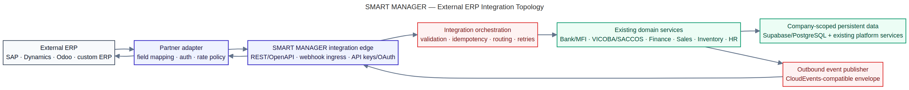
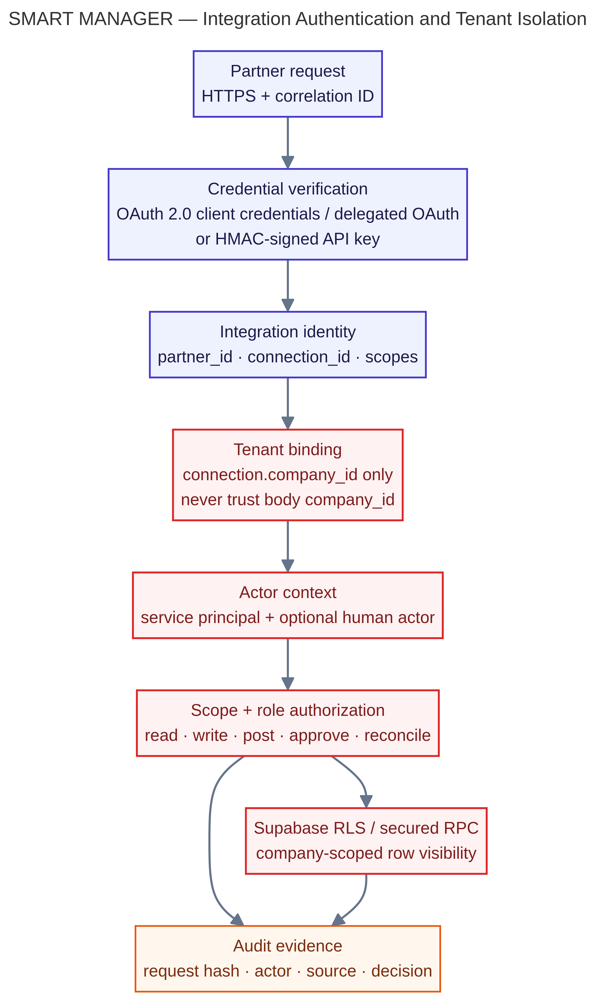
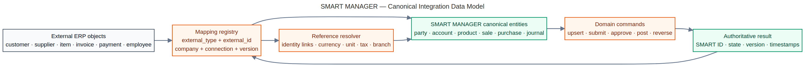
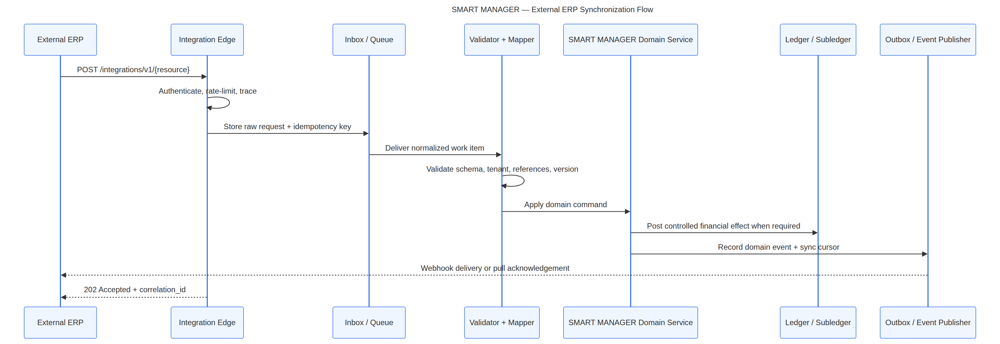
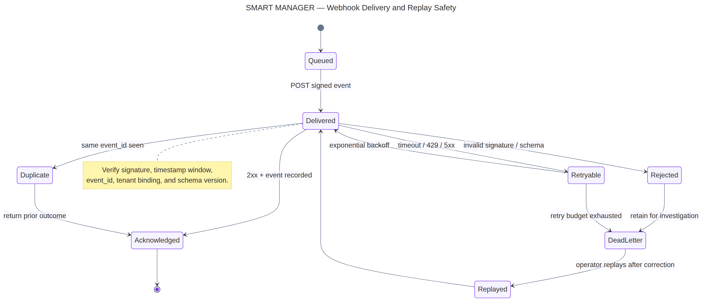
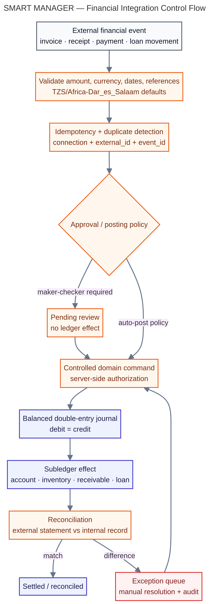

# SMART MANAGER — External ERP API Integration Blueprint

**Document status:** Production architecture blueprint
**Author:** Manus AI
**Target platform:** Existing SMART MANAGER workspace
**Primary integration goal:** Connect external ERP systems to SMART MANAGER without bypassing authentication, tenant isolation, domain validation, financial controls, audit trails, or existing module boundaries.

## 1. Executive architecture decision

External ERP systems should integrate through a **versioned partner-facing REST/OpenAPI facade** backed by SMART MANAGER’s existing protected domain services. The external facade should be separate from the internal tRPC contract used by the React workspace. tRPC remains the preferred internal UI-to-server contract; REST/OpenAPI provides a stable, language-neutral contract for SAP, Microsoft Dynamics, Odoo, custom ERP platforms, integration engines, and partner applications.

The integration layer should accept business commands and publish authoritative events. It should not expose raw database tables, accept arbitrary `company_id` values from clients, or allow external systems to write directly to Supabase/PostgREST. Every request must be bound to a registered integration connection, a SMART MANAGER company, a scoped service identity, and an auditable correlation chain.

> **Core principle:** External ERPs send intent and source references; SMART MANAGER validates, authorizes, persists, posts, reconciles, and returns authoritative SMART MANAGER identifiers and states.

The recommended target architecture is a **modular integration edge plus durable inbox/outbox processing**. Lightweight direct adapters are still appropriate for low-volume, non-financial read synchronization, while a full enterprise integration platform is justified only when a customer already operates a central iPaaS/ESB and requires multi-system orchestration beyond SMART MANAGER.

| Approach | Tradeoffs | Cost | Setup complexity |
|---|---|---:|---:|
| Direct REST/OpenAPI adapter inside SMART MANAGER | Fastest route; best for one or two external ERPs; must carefully control queues, retries, and mapping growth. | Low to medium | Medium |
| **Recommended: integration edge with inbox/outbox and adapter registry** | Strong isolation, replayability, partner-specific mappings, webhook delivery, audit, and controlled financial processing; requires durable integration tables and workers. | Medium | Medium to high |
| Existing enterprise iPaaS/ESB as primary orchestrator | Reuses customer investment and supports many systems; adds vendor cost, operational dependency, and another place where business rules can drift. | Medium to high | High |

## 2. Scope and system boundaries

The blueprint covers four integration directions:

| Direction | Example | Required behavior |
|---|---|---|
| External ERP → SMART MANAGER | Customer, supplier, product, invoice, payment, employee, or journal import | Authenticate, bind tenant, validate, map, deduplicate, execute a domain command, and return an operation status. |
| SMART MANAGER → external ERP | Sales receipt, inventory change, loan movement, payment settlement, payroll result, or audit-relevant event | Publish an immutable event with source identifiers, SMART MANAGER identifiers, version, state, and delivery metadata. |
| External ERP ↔ SMART MANAGER reference sync | Products, branches, currencies, tax codes, chart of accounts, customers, members, or employees | Use mapping registries and explicit ownership rules; do not silently overwrite fields owned by the other system. |
| External provider callback → SMART MANAGER | Bank, mobile money, tax, or payment provider callback | Verify signature, timestamp window, provider reference, event identity, tenant/connection, and state transition before posting or reconciling. |

The external ERP is never granted direct database access. Supabase/PostgREST, secured RPCs, Drizzle/MySQL platform services, and internal tRPC procedures remain behind server-side domain services. The integration edge is a controlled boundary, not a pass-through proxy.

## 3. Target topology



The topology has six logical layers. The **partner adapter** translates an ERP’s native vocabulary and authentication method. The **integration edge** exposes the stable partner API and webhook ingress. The **orchestration layer** handles request capture, validation, idempotency, routing, retries, and operation state. Existing SMART MANAGER domain services perform business authorization and persistence. The financial data plane handles journal and subledger effects where required. The outbound event publisher delivers state changes back to the external ERP.

The key architectural separation is between **transport concerns** and **business concerns**. JSON, OAuth, HMAC, pagination, HTTP status codes, and retry headers belong at the edge. Customer ownership, account opening, loan approval, stock movement, invoice posting, payment allocation, dividend calculation, and reconciliation belong in domain services.

## 4. Integration identities, tenancy, and authentication



Each external connection must be registered before data exchange. A connection record should include `connection_id`, `partner_id`, `company_id`, environment, display name, allowed scopes, credential reference, webhook endpoint, mapping version, rate limit, status, created-by, approved-by, and last-seen timestamps. The request must derive tenant scope from the connection record; the request body must not be trusted to select the company.

Supported authentication profiles should be:

| Profile | Use | Controls |
|---|---|---|
| OAuth 2.0 client credentials | ERP-to-ERP service integration where the external ERP can securely hold a client secret or private key | Short-lived access tokens, narrow scopes, client rotation, audience validation, TLS, and optional mTLS. OAuth 2.0 separates the client from the resource owner and uses access tokens with scope and lifetime attributes. [1] |
| Delegated OAuth authorization code | User-authorized integrations where a human links an ERP workspace to a SMART MANAGER company | Explicit consent, state/PKCE, redirect allow-list, refresh-token protection, revocation, and per-tenant connection records. |
| HMAC-signed API key | Controlled server-to-server partners that cannot implement OAuth | Key identifier, secret rotation, canonical request digest, timestamp/nonce window, replay protection, constant-time signature comparison, and scoped connection. |
| Private network or mTLS | High-assurance enterprise/private deployments | Certificate rotation, client identity binding, IP policy as defense in depth, and the same application-level scopes and audit controls. |

Recommended scopes are capability-oriented and least-privilege:

`customers:read`, `customers:write`, `suppliers:read`, `products:read`, `products:write`, `sales:read`, `sales:write`, `inventory:read`, `inventory:write`, `finance:read`, `finance:submit`, `finance:approve`, `finance:post`, `banking:read`, `banking:submit`, `cooperative:read`, `cooperative:submit`, `hr:read`, `reports:read`, `reconciliation:read`, and `webhooks:manage`.

A service identity may submit a financial operation but should not automatically approve or post it. Approval scopes must be explicitly granted, and maker-checker rules must prevent the same integration identity from both submitting and approving a protected transaction unless a documented policy permits it.

## 5. External API surface

The partner API should be versioned independently from internal tRPC procedures:

```text
https://api.smartmanager.tz/integrations/v1
```

The first implementation should expose these resource families:

| Resource family | Representative endpoints | Notes |
|---|---|---|
| Connections | `GET /connections/me`, `GET /connections/{id}`, `POST /connections/{id}/rotate-secret` | Administrative lifecycle; never return raw secrets. |
| Operation status | `GET /operations/{operation_id}`, `GET /operations/{operation_id}/events` | Required for asynchronous writes and support replay. |
| Parties | `POST /parties/upsert`, `GET /parties`, `GET /parties/{smart_id}` | Canonical customer, supplier, employee, member, or organization identity. |
| Products and services | `POST /products/upsert`, `GET /products`, `GET /tax-codes` | Explicit ownership and versioned mappings. |
| Sales and procurement | `POST /sales/orders`, `POST /sales/invoices`, `POST /purchases/bills` | Submission and posting states remain distinct. |
| Inventory | `POST /inventory/movements`, `GET /inventory/balances` | Server validates warehouse, item, unit, quantity, and valuation policy. |
| Finance | `POST /finance/receipts`, `POST /finance/payments`, `POST /finance/journals`, `GET /finance/statements` | Journal posting requires balanced lines and authorization. |
| Bank/MFI and cooperative | `POST /banking/transactions`, `POST /loans/applications`, `POST /cooperative/member-contributions` | Integrates with existing domain services; no direct balance writes. |
| Reports and reconciliation | `POST /reconciliation/imports`, `GET /reconciliation/{id}`, `GET /reports/{report_type}` | Import is separate from match, approval, and close. |
| Webhooks | `POST /webhook-subscriptions`, `GET /webhook-deliveries`, `POST /webhook-deliveries/{id}/replay` | Replay requires an authorized operator and audit record. |

### 5.1 Standard request headers

```http
Authorization: Bearer <short-lived-access-token>
Content-Type: application/json
Accept: application/json, application/problem+json
Idempotency-Key: erp-acme-2026-000001
X-Connection-Id: conn_01J...
X-Correlation-Id: 01J...
X-Request-Timestamp: 2026-08-23T12:00:00Z
X-Signature: sha256=...
```

`X-Connection-Id` identifies the registered connection, not the tenant by itself. The server loads the connection, checks it is active, confirms its company binding, evaluates scopes, and creates the integration actor context.

### 5.2 Standard response envelopes

Synchronous read response:

```json
{
  "data": {
    "id": "party_01J...",
    "external_ref": {"system": "acme-erp", "type": "customer", "id": "C-1042"},
    "status": "active",
    "version": 3,
    "updated_at": "2026-08-23T12:00:00Z"
  },
  "meta": {
    "correlation_id": "01J...",
    "connection_id": "conn_01J..."
  }
}
```


Asynchronous command response:

```json
{
  "operation": {
    "id": "op_01J...",
    "status": "accepted",
    "resource_type": "finance.receipt",
    "resource_id": null,
    "idempotency_key": "erp-acme-2026-000001",
    "poll_url": "/integrations/v1/operations/op_01J...",
    "accepted_at": "2026-08-23T12:00:00Z"
  },
  "meta": {"correlation_id": "01J..."}
}
```

The operation moves through a controlled state machine: `accepted → validating → pending_approval → processing → completed`, with terminal or review states such as `rejected`, `failed`, `needs_review`, `cancelled`, and `reconciled` where applicable.

## 6. Canonical data and mapping strategy



External ERP objects must be translated into canonical SMART MANAGER entities through a mapping registry. The registry should be unique on `(company_id, connection_id, external_type, external_id)` and should store the SMART MANAGER resource type, SMART MANAGER ID, source version, mapping version, last-seen hash, ownership policy, and timestamps.

Recommended canonical identity structure:

```json
{
  "external_ref": {
    "system": "acme-erp",
    "connection_id": "conn_01J...",
    "type": "customer",
    "id": "C-1042",
    "version": "etag-or-source-version"
  },
  "party": {
    "kind": "customer",
    "legal_name": "Example Traders Ltd",
    "display_name": "Example Traders",
    "tax_id": "TIN-...",
    "national_id": null,
    "phone": "+2557...",
    "email": "finance@example.co.tz"
  },
  "preferences": {"currency": "TZS", "timezone": "Africa/Dar_es_Salaam"}
}
```

Field ownership must be explicit. For example, the external ERP may own `external_customer_code` and sales territory, while SMART MANAGER owns the generated party ID, tenant binding, audit record, KYC state, account state, ledger effects, and approval state. Conflict policies should be `source_wins`, `smart_manager_wins`, `manual_review`, or `merge_by_field`; never use silent last-write-wins for financial or identity-critical fields.

### 6.1 Mapping registry fields

| Field | Purpose |
|---|---|
| `company_id` | Tenant boundary loaded from the connection. |
| `connection_id` | External integration boundary. |
| `external_type` and `external_id` | Stable source identity. |
| `smart_resource_type` and `smart_resource_id` | Canonical SMART MANAGER target. |
| `source_version` / `source_updated_at` | Incremental synchronization and conflict detection. |
| `mapping_version` | Version of transformation logic used. |
| `ownership_policy` | Field/source authority. |
| `last_payload_hash` | Duplicate and no-op detection. |
| `last_sync_status` and `last_error` | Operational support. |

## 7. Synchronization model



A write should be captured before it is processed. The integration edge records the raw request metadata, request hash, connection, correlation ID, idempotency key, and payload location in an **inbox** record. A worker validates and maps the payload, then submits a domain command. The domain service performs the authoritative transaction. An **outbox** record is written in the same logical transaction as the domain event so outbound publication cannot be silently lost.

The preferred synchronization order is:

1. Establish the connection and mapping registry.
2. Perform an initial read-only or shadow import.
3. Import reference data before transactional data: branches, currencies, tax codes, chart of accounts, warehouses, products, parties, and employees/members.
4. Import open operational records with source versions and reconciliation totals.
5. Enable incremental events or cursors.
6. Enable financial writes only after reconciliation and approval policy sign-off.
7. Monitor drift, lag, rejected records, and financial exceptions.

For incremental sync, prefer source-supported change tokens, `updated_since` windows, cursor pagination, or CDC. If the external ERP has no change feed, use bounded polling with overlap windows and source-version deduplication. Minute-level polling should run in a durable background service or managed cron/heartbeat worker, not inside a request handler or browser session.

## 8. Webhooks and replay safety



Outbound webhook delivery must be treated as at-least-once delivery. The receiver may see duplicates, out-of-order events, retries, or delayed events. Every event must contain a stable `event_id`, `event_type`, `occurred_at`, `producer`, `subject`, `company_id` or opaque tenant reference where safe, `correlation_id`, `causation_id`, `schema_version`, and a payload.

CloudEvents is a suitable interoperability envelope because it standardizes common event metadata across event sources and platforms. [2] A SMART MANAGER event may use CloudEvents attributes while retaining a domain-specific payload:

```json
{
  "specversion": "1.0",
  "type": "smartmanager.finance.receipt.posted.v1",
  "source": "smartmanager://companies/{opaque-company-ref}",
  "id": "evt_01J...",
  "time": "2026-08-23T12:01:00Z",
  "subject": "receipt_01J...",
  "datacontenttype": "application/json",
  "data": {
    "smart_id": "receipt_01J...",
    "external_refs": [{"system": "acme-erp", "id": "RC-2026-77"}],
    "status": "posted",
    "amount": {"value": "150000.00", "currency": "TZS"},
    "journal_batch_id": "jb_01J...",
    "version": 2
  }
}
```

Webhook receiver requirements are signature verification, timestamp-window checks, event-id deduplication, schema validation, tenant/connection validation, fast acknowledgement, asynchronous processing, and replay tooling. Return `2xx` only after the event identity and delivery record are safely stored. Return `4xx` for permanent schema/authentication failures and `429` or `5xx` for retryable conditions. Store delivery attempts, response status, latency, next retry time, and terminal reason.

## 9. Financial and accounting controls



Financial integrations require a stricter command path than master-data synchronization. An external invoice, receipt, payment, loan movement, or journal must be validated against currency, amount precision, tax treatment, dates, source references, account ownership, and period status. It must then pass idempotency and authorization controls before any posting.

The financial rules are:

| Control | Blueprint requirement |
|---|---|
| Amount representation | Use decimal strings or integer minor units in transport; never use binary floating-point for money. Store currency explicitly. |
| Currency | Default to TZS where company configuration allows; reject unsupported currencies rather than silently converting. |
| Period control | Reject or route to review if the target accounting period is closed or outside allowed posting windows. |
| Double entry | Every posted journal must have balanced debit and credit totals; zero-line and orphan-line batches are invalid. |
| Idempotency | Unique business key should include connection, source transaction type, external ID, source version/event ID, and operation purpose. |
| Approval | Submission, approval, posting, reversal, write-off, and reconciliation roles should be separately permissioned where policy requires. |
| Concurrency | Use row locking/version checks for balances, account state, inventory quantity, loan outstanding, and reconciliation close. |
| Reversal | Never mutate posted history in place; create an auditable reversal or adjustment command with a causal reference. |
| Reconciliation | Match internal records to external statements or source totals and retain unmatched exceptions. |
| Audit | Record actor, service principal, source system, request hash, decision, old/new state, journal reference, and correlation ID. |

External systems may send a `finance.receipt.submit` command, but SMART MANAGER should decide whether it is pending, approved, posted, rejected, or needs review. The external source’s status must be retained separately from SMART MANAGER’s authoritative status.

## 10. Error contract and retry semantics

Partner responses should use standard HTTP semantics plus `application/problem+json`. RFC 9457 defines machine-readable problem details using fields such as `type`, `title`, `status`, `detail`, and `instance`, with extension members for structured validation errors. [4]

Example:

```json
{
  "type": "https://api.smartmanager.tz/problems/duplicate-operation",
  "title": "The operation was already accepted",
  "status": 409,
  "detail": "The idempotency key has already been used for a different payload.",
  "instance": "urn:smartmanager:problem:prb_01J...",
  "correlation_id": "01J...",
  "operation_id": "op_01J...",
  "errors": [
    {"pointer": "/headers/Idempotency-Key", "code": "IDEMPOTENCY_KEY_REUSED"}
  ]
}
```

Do not expose stack traces, SQL, secrets, row-level tenant details, or internal exception messages. Problem types should be stable and documented. Use these broad classes:

| HTTP status | Meaning | Retry? |
|---:|---|---|
| 400 | Malformed request or unsupported syntax | No until corrected |
| 401 | Missing/invalid/expired credential | After credential refresh |
| 403 | Valid identity lacks scope/role or connection is blocked | No until authorization changes |
| 404 | Resource or mapping not found within the authorized tenant | Usually no |
| 409 | Idempotency conflict, version conflict, or invalid state transition | Only after caller resolves conflict |
| 422 | Well-formed but domain-invalid data | No until payload corrected |
| 429 | Rate limit exceeded | Yes, after `Retry-After` |
| 500/502/503/504 | Temporary server/dependency failure | Yes with bounded backoff |

Retries must use exponential backoff with jitter, a maximum attempt budget, and a dead-letter state. Never retry a non-idempotent financial command without a valid idempotency key.

## 11. Pagination, filtering, and query consistency

All collection endpoints should use cursor pagination for high-volume data. The response should include `next_cursor`, `has_more`, and an applied `as_of` or snapshot token where meaningful. Stable ordering should be by immutable ID plus timestamp, not by an unstable display field.

```json
{
  "data": [
    {"id": "party_01J...", "updated_at": "2026-08-23T12:00:00Z"}
  ],
  "page": {
    "limit": 100,
    "next_cursor": "eyJ1cGRhdGVkX2F0Ijoi...",
    "has_more": true
  }
}
```

External systems should be able to filter by `updated_after`, `external_id`, `status`, `branch_id`, and `source_version` where authorized. Avoid exposing arbitrary SQL-like filtering or unbounded export queries. Large exports should become asynchronous operations with an expiring download reference.

## 12. Observability and operations

Every integration request and event needs a consistent trace chain:

`correlation_id → operation_id → inbox_id → domain command ID → journal batch ID → outbox event ID → delivery ID`.

Minimum metrics should include request rate, latency, authentication failures, validation rejection rate, queue depth, oldest inbox age, processing lag, duplicate rate, retry count, dead-letter count, webhook delivery success rate, financial exception count, reconciliation difference, and per-connection error budget.

Operational screens should provide connection health, last successful sync, cursor position, lag, rejected payloads, mapping conflicts, dead letters, webhook deliveries, replay controls, and reconciliation exceptions. Replay must require an authorized operator, preserve the original payload and decision, create a new attempt ID, and never erase history.

Logs should be structured and redacted. Never log access tokens, HMAC secrets, full national IDs, KYC documents, payment credentials, or unmasked personal data. Support cases should be solvable from correlation IDs and operation IDs without exposing sensitive payloads to ordinary support roles.

## 13. Data protection and secrets

Secrets belong in a server-side secret manager or encrypted configuration store, never in the React bundle, public environment variables, Git repository, URL query string, or audit payload. Store only a key identifier and encrypted/rotatable reference where possible. Provide separate credentials for sandbox and production.

Personal data should be minimized at the integration edge. Use opaque SMART MANAGER identifiers in outbound events where the partner can resolve details through an authorized read endpoint. Protect NIDA/TIN/KYC fields with field-level permissions and redaction. Define retention periods for raw payloads, audit evidence, webhook bodies, and export files.

## 14. Testing strategy

A partner certification suite should be mandatory before production activation. It should test authentication, tenant binding, scope rejection, schema validation, mapping creation, idempotent replay, version conflict, pagination, retry behavior, webhook signature failure, duplicate webhook, out-of-order event, financial balance failure, maker-checker separation, closed-period rejection, reconciliation exception, and audit evidence.

The end-to-end financial certification path should be:

1. Import or resolve a customer, supplier, member, employee, product, branch, and chart-of-accounts mapping.
2. Submit a sales invoice or receipt and confirm the accepted operation.
3. Verify the domain state and journal batch after approval/posting policy.
4. Retry the same request and verify no duplicate transaction or journal effect.
5. Send a settlement callback and verify status transition plus reconciliation record.
6. Send an invalid amount, currency, account, or tenant reference and verify a safe rejection.
7. Replay a valid event and verify a single authoritative outcome.
8. Confirm audit chain completeness from external reference to SMART MANAGER record, journal, reconciliation, and webhook delivery.

## 15. Rollout plan

| Phase | Outcome | Gate |
|---:|---|---|
| 0. Contract design | OpenAPI, schemas, event types, scopes, mapping policy, error types | Architecture and security review |
| 1. Connection registration | Partner identity, sandbox credentials, tenant binding, scopes | Credential rotation and tenant-isolation test |
| 2. Read-only discovery | Reference-data reads, metadata, mappings, pagination | No cross-tenant leakage; acceptable latency |
| 3. Shadow synchronization | Inbound payload capture and mapping without business mutation | Mapping accuracy and drift report |
| 4. Non-financial writes | Parties, products, inventory metadata, non-posting records | Idempotency and replay certification |
| 5. Controlled financial submission | Invoices, receipts, payments, loan/cooperative commands pending approval | Accounting, maker-checker, and reconciliation sign-off |
| 6. Event activation | Outbound webhooks and provider callbacks | Signature, retry, duplicate, and dead-letter tests |
| 7. Production cutover | Incremental cursor, monitoring, support runbook, rollback | Business owner acceptance and verified operational dashboards |

Rollback should disable the connection or write scopes, not delete historical records. Already accepted operations must remain queryable and reconcilable. If a mapping is wrong, pause the connection, correct the mapping version, replay only from the controlled inbox, and preserve the original attempts.

## 16. Recommended implementation shape in the existing project

The existing SMART MANAGER architecture should retain tRPC for the internal React workspace and add a dedicated integration boundary. A practical implementation split is:

```text
server/integrations/
  connectionService.ts
  authService.ts
  idempotencyService.ts
  inboxService.ts
  outboxService.ts
  mappingService.ts
  webhookService.ts
  operationService.ts
  adapters/
    sap.ts
    dynamics.ts
    odoo.ts
    generic.ts
  schemas/
    common.ts
    parties.ts
    finance.ts
    inventory.ts
    banking.ts
  routers/
    externalErp.ts
```

The public REST facade can be mounted under `/api/integrations/v1` while internal workspace procedures remain in `server/routers.ts` or feature routers. Shared domain wrappers should call established service boundaries such as the Bank/MFI operations layer, verified-profile/tenant guard, RLS-secured routines, and financial posting controls. The browser should never call the partner API with a secret; partner credentials are server-side only.

Database additions should be additive and company-scoped:

| Table | Purpose |
|---|---|
| `integration_partners` | Partner catalog and capabilities. |
| `integration_connections` | Connection-to-company binding, scopes, environment, status. |
| `integration_credentials` | Rotatable secret references and metadata, not plaintext secrets. |
| `integration_mappings` | External-to-SMART MANAGER identity mapping and ownership. |
| `integration_inbox` | Immutable inbound request/event capture and processing state. |
| `integration_operations` | Async command status and queryable result. |
| `integration_outbox` | Transactionally recorded outbound events. |
| `integration_webhook_subscriptions` | Partner endpoints, event filters, secret/key references. |
| `integration_webhook_deliveries` | Attempts, responses, retries, and dead-letter state. |
| `integration_reconciliation_runs` | Source totals, internal totals, differences, and approvals. |

All integration tables require company-scoped RLS, role-aware access, audit records, retention policy, and indexes on connection, external reference, operation status, event ID, and timestamps.

## 17. OpenAPI and documentation requirements

Publish an OpenAPI document as the source of truth for the partner API. OpenAPI provides a language-agnostic description that humans and tools can use to discover API capabilities, schemas, security requirements, and webhooks. [3] The repository should contain:

```text
api/openapi/integrations-v1.yaml
api/schemas/common.yaml
api/schemas/finance.yaml
api/schemas/inventory.yaml
api/events/catalog.yaml
api/examples/
api/changelog.md
```

CI should lint the OpenAPI document, detect breaking changes, validate example payloads, generate partner documentation, and run contract tests against the integration edge. Every new event type or field should have a compatibility rule and versioning decision.

## 18. Final architecture position

The integration should be implemented as a **controlled business boundary**, not a generic data pipe. The external ERP retains its own source identifiers and operational ownership, while SMART MANAGER remains authoritative for the records and controls it owns. The integration edge provides stable contracts; the orchestration layer provides durability and replay; existing domain services enforce business meaning; the financial plane enforces balanced accounting; and the audit/reconciliation plane proves what happened.

This design permits incremental onboarding of SAP, Dynamics, Odoo, or custom ERPs without replacing the SMART MANAGER workspace. It also protects the Bank/MFI, VICOBA/SACCOS, Finance, Accounting, POS, Inventory, HR, and vertical modules from direct external mutation that could bypass their existing validation, tenant, approval, ledger, and audit controls.

## References

[1]: https://datatracker.ietf.org/doc/html/rfc6749 "RFC 6749 — The OAuth 2.0 Authorization Framework"
[2]: https://cloudevents.io/ "CloudEvents — A specification for describing event data in a common way"
[3]: https://spec.openapis.org/oas/latest.html "OpenAPI Specification v3.2.0"
[4]: https://www.rfc-editor.org/rfc/rfc9457 "RFC 9457 — Problem Details for HTTP APIs"
