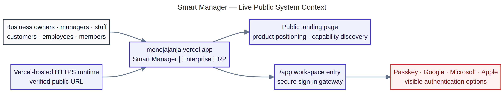
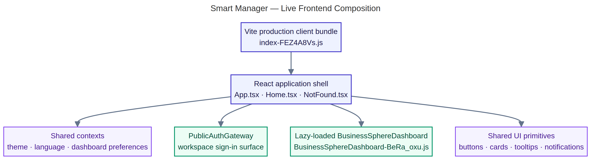
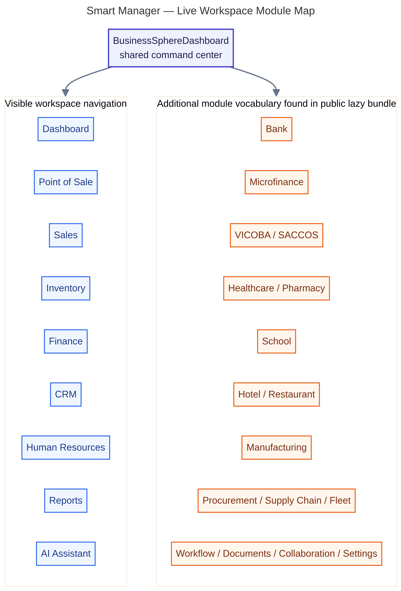
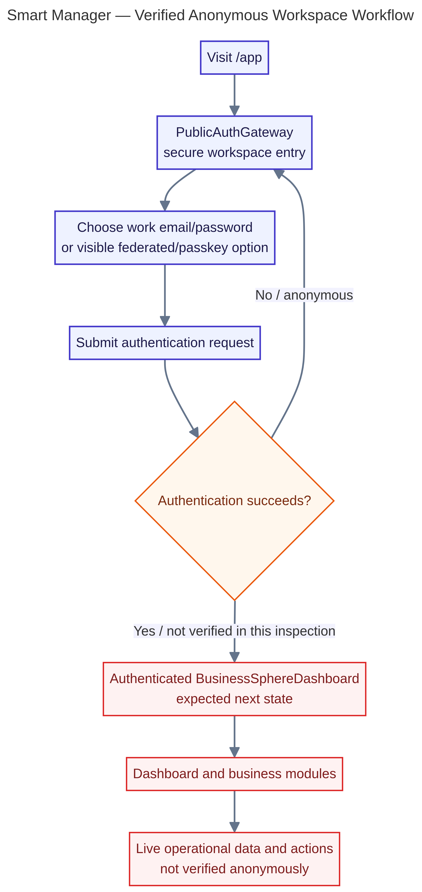
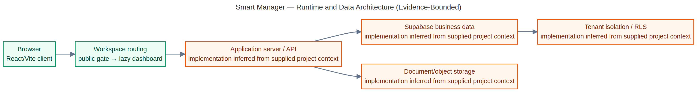
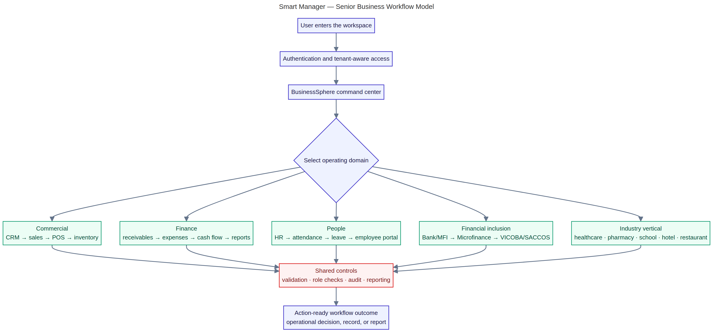
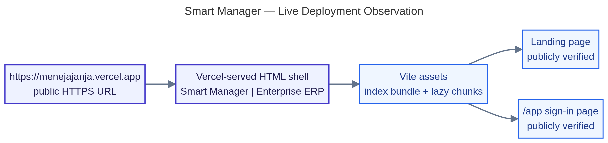

# Smart Manager — Live-Site Architecture and Workflow Report

**Inspected application:** [https://menejajanja.vercel.app](https://menejajanja.vercel.app)
**Inspection date:** 23 August 2026
**Author:** Manus AI
**Inspection mode:** Read-only public inspection; no credentials submitted and no business mutations performed.

## Executive assessment

The live URL is a Tanzania-oriented enterprise ERP presentation and workspace gateway branded **Smart Manager | Enterprise ERP**. The public landing page positions the product as a unified command center for commercial, financial, and operational workflows. The `/app` route exposes a secure workspace entry surface with authentication controls, module-focus selection, and a visible navigation vocabulary for Dashboard, Point of Sale, Sales, Inventory, Finance, CRM, Human Resources, Reports, and AI Assistant.

The public frontend build also contains a lazy-loaded `BusinessSphereDashboard` chunk with vocabulary for a much broader domain ecosystem: Bank, Microfinance, VICOBA/SACCOS, Healthcare, Pharmacy, School, Hotel, Restaurant, Manufacturing, Procurement, Supply Chain, Fleet, Documents, Collaboration, Workflow, Settings, and other capabilities. This is strong evidence of a modular client-side product composition. It is not, by itself, proof that every module is currently reachable, authenticated, persistent, or production-complete.

> **Architecture confidence rule:** This report labels publicly visible behavior as **verified**, client-bundle discoveries as **verified client evidence**, and server/database behavior as **inferred from supplied project context** unless it was directly observable in the anonymous live session.

## Inspection boundary and evidence quality

| Evidence category | Status | What was established |
|---|---|---|
| Public landing page | Verified | Product identity, Tanzania positioning, capability messaging, calls to action, and visible design system. |
| `/app` entry route | Verified | Secure workspace entry shell, visible navigation labels, module-focus selector, and authentication options. |
| Browser runtime | Verified | Vercel-hosted HTTPS response, Vite-style assets, lazy-loaded dashboard chunk, and no captured console error during the read-only session. |
| Client bundle vocabulary | Verified client evidence | Broad module names and source-location metadata for the dashboard and selected workspaces. |
| Authenticated dashboard | Not verified | The anonymous inspection stopped at the sign-in surface. |
| Business mutations | Not tested | No credentials or test fixture data were used; no form was submitted. |
| Backend procedures, database, RLS | Inferred / supplied context | The architecture model uses the previously supplied project context, but the live public route alone cannot prove runtime persistence or policy behavior. |

## 1. Live public system context

The live public context has two clearly visible product states: the public marketing surface and the secure workspace entry surface. The public URL is served over HTTPS from Vercel. The landing page routes users toward `/app`, while the workspace route exposes passkey and federated authentication choices alongside conventional work-email/password sign-in.

A senior architect should treat OAuth/passkey providers and Vercel as external boundaries. The application should translate identity into an internal verified profile and should keep provider interactions behind a controlled authentication gateway. The public page’s Tanzania branding and Kiswahili option are product-localization signals, while the external providers remain replaceable integration dependencies.

## 2. Live frontend composition

The production client is a Vite-style build. The main bundle loads the React application shell and lazy-loads the `BusinessSphereDashboard` feature chunk. Public source-location metadata in the bundle references `client/src/App.tsx`, `client/src/pages/Home.tsx`, `client/src/pages/NotFound.tsx`, `client/src/BusinessSphereDashboard.jsx`, and selected shared workspaces.

This is a sound performance and maintainability direction for a large ERP: the initial public surface does not need to eagerly download every feature. Shared theme, language, and dashboard-preference contexts provide cross-module consistency. The architectural risk to monitor is bundle growth and feature coupling: as the dashboard chunk grows, further domain-level lazy loading and explicit module contracts will become important.

## 3. Live workspace module map

The visible `/app` navigation establishes the core operating spine: Dashboard, Point of Sale, Sales, Inventory, Finance, CRM, Human Resources, Reports, and AI Assistant. The module-focus selector adds Universal business, Retail & wholesale, Manufacturing, Professional services, Healthcare, Education, and Hospitality as operating contexts.

The lazy bundle provides additional client-side evidence for Bank, Microfinance, VICOBA/SACCOS, healthcare/pharmacy, school, hotel/restaurant, manufacturing, procurement, supply chain, fleet, workflow, documents, collaboration, and settings. The appropriate senior architecture interpretation is a **shared ERP shell with bounded domain workspaces**. Each domain should own its vocabulary and workflows while reusing common authorization, persistence, audit, reporting, notification, and financial-posting primitives.

## 4. Verified anonymous authentication workflow

The observed workflow begins when a user visits `/app` and reaches `PublicAuthGateway`, the secure workspace entry screen. The page offers work email/password authentication and visible passkey, Google, Microsoft, and Apple paths. The anonymous inspection did not submit any credential or invoke a provider, so the successful-authentication branch is deliberately marked as an expected next state rather than a verified live result.

From a security perspective, the authentication gateway is the correct place to establish a session, resolve the user’s tenant/company, and load role-aware permissions. After authentication, the dashboard should not trust client-provided company identifiers, actors, balances, approval identities, or role claims. Those values must be verified server-side and enforced again at the database policy boundary.

## 5. Evidence-bounded runtime and data architecture

The browser and workspace routing path are directly supported by the live build evidence. The server/API, Supabase business data, tenant isolation/RLS, and object storage are represented as **inferred from the supplied project context**, not as anonymous live observations. This distinction is important in a production architecture report: a client bundle can show that a feature exists in the frontend without proving that its server procedure, migration, policy, or provider integration is healthy.

The recommended runtime contract is a protected API boundary between the React client and business services. Business writes should execute through validated server procedures, use company-scoped records, enforce role checks and financial invariants, and return authoritative persisted results. Storage should be referenced through controlled object access rather than exposing unrestricted document paths.

## 6. Senior business workflow model

The live product’s central workflow can be understood as: user entry → authentication and tenant-aware access → BusinessSphere command center → operating-domain selection → domain workflow → shared controls → action-ready outcome. Commercial workflows connect CRM, sales, POS, and inventory. Finance covers receivables, expenses, cash flow, and reports. People operations connect HR, attendance, leave, and the employee portal. Financial inclusion connects Bank/MFI, Microfinance, and VICOBA/SACCOS. Industry verticals cover healthcare, pharmacy, school, hotel, and restaurant operations.

The shared controls are the most important architectural component. Validation, role checks, audit events, reconciliation, and reporting should not be reimplemented independently inside every module. They should be centralized as reusable server-side capabilities so a new cooperative or financial workflow cannot accidentally bypass tenant isolation, maker-checker approval, idempotency, or balanced accounting.

## 7. Live deployment observation

The public URL verifies that a Vercel-served HTTPS runtime is reachable and returns a Smart Manager application shell. The browser observed a main Vite asset bundle and a lazy-loaded dashboard chunk. This confirms public delivery of the frontend artifact.

It does not establish repository ownership, deployment freshness, serverless function health, database migration compatibility, or authenticated production readiness. The release standard should therefore be: source change → quality gates → deployment → ready deployment status → browser smoke test → authenticated workflow test using controlled data. A public landing page alone is not sufficient evidence of end-to-end production health.

## Senior architecture recommendations

The product should continue evolving incrementally around a shared platform kernel. That kernel should contain session/profile verification, company tenancy, role and permission evaluation, input schemas, audit events, idempotency, concurrency controls, file access, notifications, scheduled execution, financial posting, reconciliation, and reporting contracts. Domain modules should be thin consumers of those primitives rather than independent mini-platforms.

The client-side module vocabulary suggests a broad product ambition. The main engineering priorities should be contract discipline and runtime observability: document which modules are verified, instrument API error rates and workflow completion, enforce consistent loading/error/empty states, split the dashboard bundle by domain, and make every financial mutation traceable from UI action to server procedure, database transaction, journal effect, and audit record.

For Bank/MFI and VICOBA/SACCOS, the architecture should preserve clear boundaries between member/customer aggregates, accounts, shares, savings, lending, approvals, settlements, arrears, dividends, meetings, welfare, and the general ledger. Integration should occur through explicit domain services and balanced financial posting. External mobile-money or bank operations must use provider status, reference IDs, callbacks, and reconciliation rather than fabricated confirmations.

## Known limitations of this inspection

The live site presented an authentication wall in the anonymous browser session. Therefore, the authenticated dashboard, live tenant data, server procedures, database persistence, role permissions, financial mutations, reports, and provider settlement workflows were not directly tested. This is an evidence limitation, not a runtime-error finding. The report intentionally avoids claiming that unobserved capabilities are production-complete.

## References

[1]: https://menejajanja.vercel.app "Smart Manager live application inspected on 23 August 2026"
